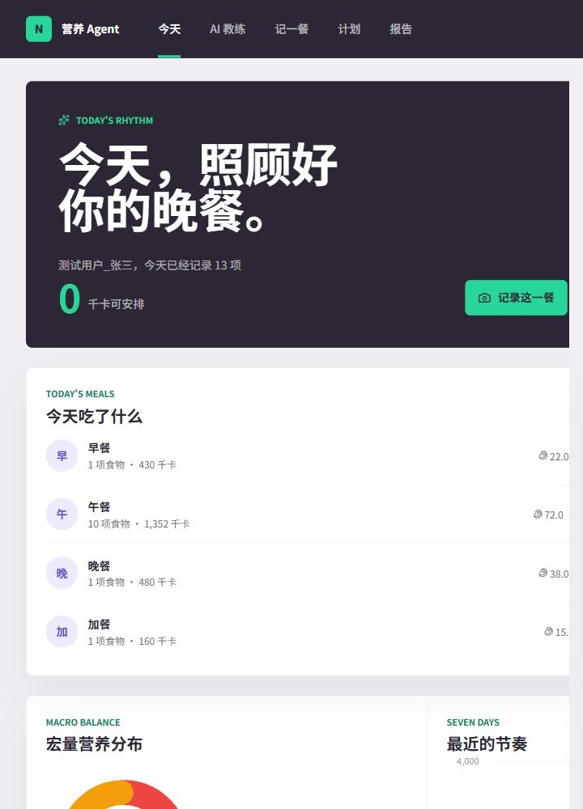
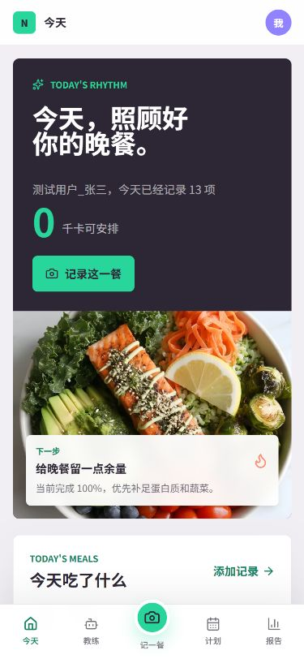

# Nutrition Agent - 本地个人营养工具

这是一个私有单用户、本地优先的营养 Agent。它保留饮食记录、营养看板、日历、运动建议和周期报告，并加入多 AI 提供商、跨会话长期记忆、营养对话和受控外卖工具。


## 能力

- 拍照识别食物，审核后保存营养数据
- 营养看板、日历、周/月报告和运动建议
- GUI 配置 10 类 OpenAI-compatible AI 提供商
- 本地 Agent 对话、个人档案/近期餐食/长期记忆注入
- 记忆查看、修正、停用、恢复和删除
- MCP 工具白名单、超时、输出隔离和外部写动作确认门
- 附近外卖搜索、订单草案和明确确认后的授权连接器提交

## 技术栈

- Next.js 16、React 19、Tailwind CSS
- Prisma 6、SQLite
- OpenAI-compatible AI Provider Gateway
- 本地文件凭据存储与环境变量回退

## 启动

```powershell
Copy-Item .env.example .env
npm ci
npm run db:init
npm run dev
```

首次启动后，在 `/profile` 创建或修正个人档案，并在“AI 服务”中保存提供商、Base URL、模型和 API Key。完整密钥只由本机服务端持有，不会回显到浏览器。

## 外卖 MCP

可选环境变量：

```dotenv
TAKEOUT_MCP_URL="https://your-authorized-bridge.example"
TAKEOUT_MCP_API_KEY=""
```

连接器接收 `POST` JSON：`{ "tool": "工具名", "input": { ... } }`。当前白名单工具是 `nearby_takeout_search` 和 `takeout_order_submit`。地址必须使用 HTTPS，或使用 loopback HTTP 进行本机开发。

搜索是只读动作；订单草案不会提交；外部提交需要绑定最终参数、十分钟有效且只能使用一次的确认令牌。没有官方或用户授权的连接器时，应用会明确显示“未配置”，不会声称真实下单成功。

## 发布检查

```powershell
npm run release:check
```

该命令检查 5 条 migration、AI/记忆/Agent/MCP 合同、lint、TypeScript、production build、临时数据库 API、假 AI/MCP 连接器和 loopback production smoke，不调用真实外部服务。

| Command | Purpose |
| --- | --- |
| `npm run db:init` | 创建 SQLite、执行 migration 并写入运动参考数据 |
| `npm run verify` | 运行合同测试、lint、typecheck 和 production build |
| `npm run verify:agent-api` | 使用本地假 AI 验证对话与记忆确认流 |
| `npm run verify:mcp-api` | 使用本地假 MCP 验证输出隔离和动作确认门 |
| `npm run smoke` | 启动 production server 并验证页面与 API 信封 |
| `npm run release:check` | 执行完整发布门禁 |

## 数据与迁移

数据库位于本机且被 Git 忽略。对已有数据库操作前应先备份，并在副本上执行 migration；不要对唯一一份用户数据直接运行初始化命令。

```text
src/app/          Next.js 页面和 API
src/components/   业务组件与 UI primitives
src/lib/          Agent、AI、记忆、MCP 和动作策略
prisma/           Schema、migration 和 reference seed
scripts/          发布与端到端验证
dev_repo/         合同、架构、数据模型和证据真相
```

## C-12 云端演示与核心 E2E

测试用户已经填充了一组可重复的真实演示数据：14 天饮食、7 天活动量、3 条运动计划和 3 条长期记忆。真实云端回归确认了三条核心闭环：照片识别返回并保存 9 项食物，健康 Agent 真实完成 2/2 步骤的时间线回合，麦当劳 MCP 只读探测返回 29 个工具且没有创建订单或触发支付。





完整截图索引、UI 参考图和 E2E 证据见 [`docs/demo/C-12-E2E.md`](docs/demo/C-12-E2E.md) 与 [`dev_repo/evidence/C-12/e2e/real-core-flows.json`](dev_repo/evidence/C-12/e2e/real-core-flows.json)。
