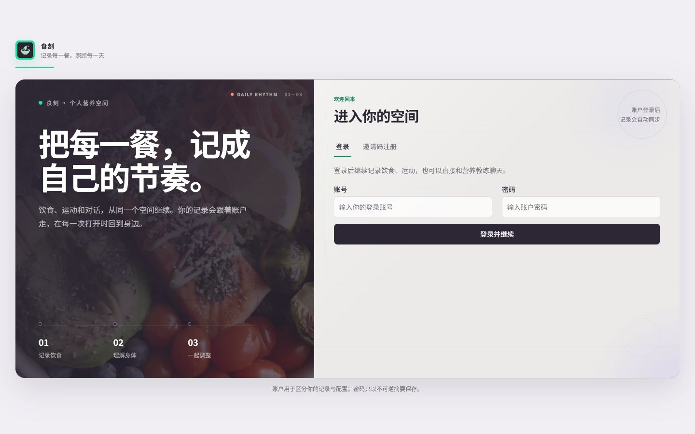
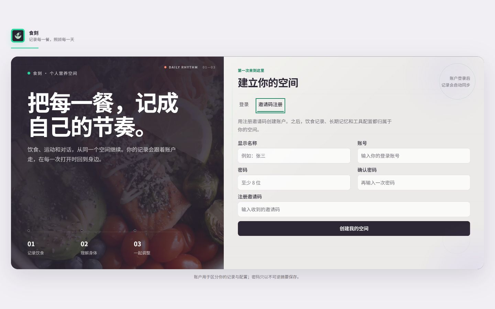
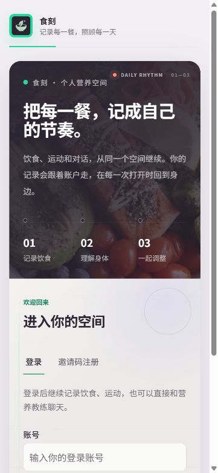
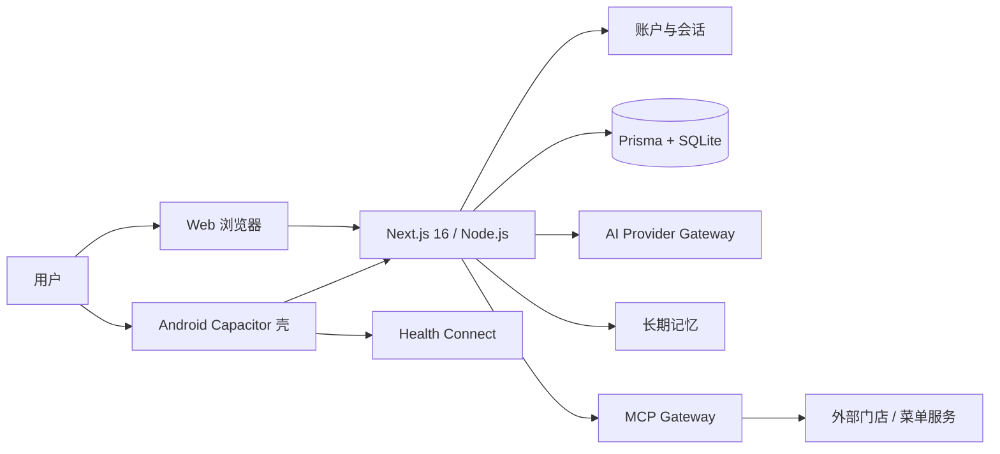

# 食刻 · FoodMoment

> 把每一餐，记成自己的节奏。

<p align="center">
  
</p>

<p align="center">
  一个以长期记忆为核心、把饮食记录、健康对话和行动建议放在同一个空间里的个人营养 Agent。
</p>

<p align="center">
  <a href="http://8.148.206.131:8000">在线体验</a> ·
  <a href="docs/demo/C-12-E2E.md">核心 E2E 证据</a> ·
  <a href="dev_repo/evidence/C-19/S2/verification.json">最近发布验证</a>
</p>

<p align="center">
  
  
  
  
</p>

## 产品概览

食刻（FoodMoment）不是一个只会生成卡路里数字的记录器，也不是把聊天、图表和设置拆散到不同产品里的工具集合。它把用户每天产生的饮食、运动和对话，收拢为一条可持续的个人健康上下文：

```text
记录一餐  →  看懂这一餐  →  和 Agent 讨论下一步  →  沉淀为长期记忆
    ↑                                               ↓
    └────────────── 下一次对话继续使用 ──────────────┘
```

当前产品最重要的三个闭环是：

| 闭环 | 用户动作 | 系统结果 |
| --- | --- | --- |
| 拍照识别 | 拍照或选择餐食图片，检查识别结果并确认 | 识别出的多项食物以一次事务写入餐食记录 |
| 健康 Agent | 在同一条长期对话里询问饮食、运动和计划 | Agent 读取档案、近期记录、健康活动和长期记忆，再以可观察的时间线返回结果 |
| 麦当劳 MCP | 查询附近门店、查看菜单、明确表达点餐意图 | 通过白名单工具完成搜索或订单草案；外部写操作需要明确确认，不代替支付 |

## 三条核心体验

### 01 · 拍照识别：先看清，再保存

拍照识别的交互不是“模型说了算”。图片送入同源 AI Gateway 后，识别结果会进入审核态；用户可以检查名称、份量和营养字段，确认后才通过 `/api/meals` 保存。

```text
相机 / Photo Picker
        ↓
      /api/ai/recognize
        ↓
识别结果待审核 → 用户确认 → /api/meals 事务保存
```

真实云端回归中，测试图片识别出 9 项食物，审核确认后保存 9 项；原始图片本体不会写入 SQLite。证据见 [`real-core-flows.json`](dev_repo/evidence/C-12/e2e/real-core-flows.json)。

### 02 · 健康 Agent：一个助手，持续认识你

Agent 使用单一长期对话，而不是要求用户手动维护许多互相割裂的会话。每次请求会组合以下上下文：

- 用户营养档案与目标
- 近期饮食记录
- 近期运动/Health Connect 聚合数据
- 当前有效的长期记忆
- 当前对话消息与历史滚动摘要

执行过程会以时间线形式展示关键步骤，例如“整理饮食档案与对话上下文”以及“生成健康建议”。可持久化的内容仍然只有用户和 Agent 消息；系统提示词、Token、支付凭据和外部订单凭据不会进入对话记录或记忆。

### 03 · 麦当劳 MCP：能用，但边界清楚

MCP Gateway 对外部工具采用白名单、超时、输出隔离和动作策略。当前能力包括：

1. 搜索附近门店和菜单；
2. 读取可用商品与价格；
3. 在用户明确表达点餐意图后生成一次性的订单草案；
4. 把最终确认交还给用户，不代替支付、不自动连续下单。

最近一次真实云端 MCP 探测返回 HTTP 200，并发现 29 个工具；该轮只做工具发现，没有创建订单、提交订单或触发支付。完整安全字段见 [`real-core-flows.json`](dev_repo/evidence/C-12/e2e/real-core-flows.json)。

## 产品走廊

### 入口：食刻的个人空间

入口页采用深梅紫、食物摄影、薄荷绿和纸张质感，登录与邀请码注册共用一套编辑式工作室布局。动效包含品牌入场、背景网格漂移、时间线节点、轨道呼吸和按钮反馈，并在 `prefers-reduced-motion` 下自动降级。

<table>
  <tr>
    <td align="center" width="50%"><br /><sub>云端桌面登录 · 1440×900</sub></td>
    <td align="center" width="50%"><br /><sub>云端桌面邀请码注册 · 1440×900</sub></td>
  </tr>
  <tr>
    <td align="center" colspan="2"><br /><sub>云端移动端登录 · 375×812</sub></td>
  </tr>
</table>

### 工作台：记录、对话和计划在同一套节奏里

<table>
  <tr>
    <td align="center"><br /><sub>桌面工作台</sub></td>
    <td align="center"><br /><sub>移动端工作台</sub></td>
  </tr>
</table>

### Agent、餐食与配置

这些截图来自仓库内的真实 UI 回归素材，分别展示 Agent 对话、餐食记录和账户级 AI/MCP 配置入口：

| Agent 对话 | 餐食记录 | AI / MCP 设置 |
| --- | --- | --- |
|  |  |  |
|  |  |  |

## 架构与数据同步

食刻采用“单服务、单生产 SQLite 真相源”的交付形态。Web 和 Android 都是客户端入口，不各自维护一份业务数据库，也不引入离线双写同步引擎。



### 数据归属

- `UserAccount`：账户身份、密码哈希和账户生命周期；
- `AuthSession`：可撤销的浏览器/WebView 会话；
- `UserProfile`：营养领域档案和目标；
- `AccountSettings`：账户级 AI Provider 与麦当劳 MCP 配置；
- 餐食、活动、Agent 消息和 `MemoryItem`：均按当前认证账户隔离；
- Android Health Connect 原始明细留在设备侧，服务端只持久化按日聚合值；
- 生产 SQLite 位于服务端，Web 与 Android 读取同一份对话、记录、记忆和配置。

### 长期记忆如何工作

Agent 会在对话收尾阶段生成结构化记忆候选，记录来源、置信度、来源消息和启用状态。用户可以查看、编辑、停用、恢复或删除记忆；Agent 不得覆盖用户修正，也不得重新创建用户已停用的同类记忆。

## 本地启动

### 环境要求

- Node.js 20+
- npm 11+
- SQLite（由 Prisma 管理）
- 如需真实 AI/MCP 能力，在应用设置中配置对应凭据

### 安装与开发

```powershell
Copy-Item .env.example .env
npm ci
npm run db:init
npm run dev
```

打开 [http://localhost:3000](http://localhost:3000)。本地默认关闭账户门（`AUTH_REQUIRED=false`），方便开发；要回归生产账户流程，可在服务端环境中打开账户门并设置邀请码：

```dotenv
AUTH_REQUIRED=true
AUTH_BOOTSTRAP_INVITE_CODE="只放在服务端环境，不要提交到 Git"
```

然后从 `/access` 进入登录或邀请码注册。

### 本地开发与云端生产的区别

| 项目 | 本地开发 | 云端生产 |
| --- | --- | --- |
| 服务地址 | `http://localhost:3000` | `http://8.148.206.131:8000` |
| 账户门 | 默认关闭，可手动打开 | 必须开启 |
| 数据库 | 本地 SQLite | 服务端持久化 SQLite |
| Android | loopback / `adb reverse` 开发回路 | `npm run android:cloud` 烘焙云端地址 |
| 凭据 | `.env` 或账户设置 | 服务端环境与账户级 `AccountSettings` |

## AI 与 MCP 配置

所有完整密钥都由服务端持有，浏览器只提交设置表单，不把 API Key 或 MCP Token 写入前端构建物、聊天消息、长期记忆或 Git。

### AI Provider

登录后进入“设置 → AI 与工具”，填写：

- Provider 名称；
- OpenAI-compatible Base URL；
- 模型名；
- API Key。

保存后可以使用设置页的连通性测试。不同账户的配置互相隔离；第一账户可以兼容导入旧的本地运行时配置，后续账户从空配置开始。

### 麦当劳 MCP

进入“设置 → 麦当劳”后，按照页面内的 Token 获取指引完成配置。服务端环境变量也支持本地兼容回退：

```dotenv
MCDONALDS_MCP_URL="https://mcp.mcd.cn"
MCDONALDS_MCP_TOKEN=""
```

Token 获取、轮换和失效处理应以 MCP 服务方控制台为准。不要把真实 Token 写入 README、截图、日志、Agent 消息或提交记录。设置页的“测试连接”只验证工具发现和输出隔离，不代表已经创建订单。

## Android

Android 使用 Capacitor WebView，保持与 Web 同一套页面和 API；原生能力只在需要时通过宿主边界接入：

- 系统相机：拍照识别的原生入口；
- Photo Picker：浏览器兼容回路；
- Health Connect：按用户授权读取健康数据并按日聚合；
- 云端形态 B：直接加载公网服务，和 Web 共用账户与 SQLite 真相源。

### 云端 Android 壳

```powershell
npm run android:cloud
npx cap sync android
```

然后使用 Android Studio 或 Gradle 构建 APK。开发回路仍可通过 `npx cap sync android` 恢复为本机 loopback 配置。

## 部署到云端

当前部署目标是 `/home/soft/final` 下的单实例服务，监听 8000 端口。服务器不构建源码，部署管道在本机完成 standalone 构建后上传产物，再在服务器执行迁移和 systemd 重启：

```powershell
npm run deploy
```

该命令依次完成：

1. Next.js standalone production build；
2. 产物打包与上传；
3. `prisma migrate deploy`；
4. 重启 `foodtracker` systemd 服务；
5. `/access → 200` 和匿名 `/api/users → 401` smoke。

生产配置位于服务器环境中，不进入 Git。访问域名和 TLS 尚未配置前，当前公网地址是 HTTP IP；不要在此环境传输真实敏感数据。

## 验证与发布门禁

### 常用命令

| 命令 | 作用 |
| --- | --- |
| `npm run verify` | 合同测试、lint、TypeScript 和 production build |
| `npm run release:check` | migration、核心合同、API、Agent、MCP 和本地 production smoke |
| `npm run verify:agent-api` | Agent 对话与长期记忆确认流 |
| `npm run verify:mcp-api` | MCP 输出隔离和动作确认门 |
| `npm run verify:cloud-gate` | 云端账户门、登录、会话和 Agent 页面 |
| `npm run smoke` | 本地 production server 页面与 API smoke |
| `npm run deploy` | standalone 发布、云端迁移、重启与云端 smoke |
| `npm run android:cloud` | 生成云端 Android 形态 B 配置 |

### 最近一次真实核心回归

| 能力 | 结果 | 证据 |
| --- | --- | --- |
| 拍照识别 | 通过：9 项识别结果，审核后保存 9 项 | [`real-core-flows.json`](dev_repo/evidence/C-12/e2e/real-core-flows.json) |
| 健康 Agent | 通过：真实对话时间线 2/2 步完成，并引用饮食、运动和长期记忆 | [`real-core-flows.json`](dev_repo/evidence/C-12/e2e/real-core-flows.json) |
| 麦当劳 MCP | 通过：HTTP 200，29 个工具；未创建订单、未提交、未支付 | [`real-core-flows.json`](dev_repo/evidence/C-12/e2e/real-core-flows.json) |
| 双端同源 | 通过：Web/Android 读取同一云端账户、对话、餐食与记忆 | [`C-12-E2E.md`](docs/demo/C-12-E2E.md) |
| 入口发布 | 通过：公网入口 200、匿名业务 API 401、桌面/移动视觉回归 | [`C-19-S2`](dev_repo/evidence/C-19/S2/verification.json) |

## 安全边界

- 业务 API 在生产账户门下必须先通过认证；未认证请求返回 401；
- 密码只保存为服务端哈希，认证使用 httpOnly 会话 cookie；
- AI Key、MCP Token、访问码和服务器密码不进入浏览器构建物、截图、日志、Agent 消息、MemoryItem 或 Git；
- MCP 工具采用白名单、输入约束、超时和输出隔离；
- 搜索和订单草案不等于支付授权；支付动作始终交还用户；
- 生产 SQLite 是单实例真相源，当前不支持多实例共享写入；
- Android Health Connect 原始明细不上传，服务端只接收按日聚合值；
- 营养估算和运动建议是健康管理辅助信息，不构成医疗诊断。

## 仓库结构

```text
src/app/                 页面与 API Route
src/components/          产品组件与 UI primitives
src/lib/                 AI、Agent、Memory、MCP、Action Policy
prisma/                  schema、migration 与 seed
scripts/                 测试、smoke、部署与云端验证
android/                 Capacitor Android 壳与原生适配
public/brand/            食刻品牌图标与 mark
docs/demo/               README 与演示用截图、E2E 文档
dev_repo/architecture/   架构与数据模型真相
dev_repo/evidence/       每个交付切片的验证证据
```

## 已知限制

1. 当前公网仍是 IP + HTTP，域名与 TLS 是后续交付项；
2. SQLite 采用单实例、单写入形态，不是多租户 SaaS 数据层；
3. Android 真机回归尚未纳入 CI，已有模拟器和云壳回归证据；
4. Next.js 当前提示 middleware convention 将迁移为 proxy，这是一项独立维护任务，不影响本次发布；
5. MCP 能力取决于服务方 Token、门店覆盖、菜单可用性和当前接口协议。

## 文档与证据索引

- [核心 E2E 说明](docs/demo/C-12-E2E.md)
- [核心闭环结构化证据](dev_repo/evidence/C-12/e2e/real-core-flows.json)
- [演示数据清单](dev_repo/evidence/C-12/data-manifest.json)
- [截图索引](dev_repo/evidence/C-12/screenshot-index.json)
- [入口页最近发布验证](dev_repo/evidence/C-19/S2/verification.json)
- [架构宪法](dev_repo/architecture/README.md)
- [数据模型说明](dev_repo/architecture/data-model/README.md)

## 开发约定

提交代码前至少运行：

```powershell
npm run lint
npm run typecheck
npm run build
```

涉及数据库、Agent、Memory、MCP、账户或部署边界的变更，还应补充对应 `dev_repo/evidence/` 证据，并在提交前确认没有暂存 `.env`、数据库文件、凭据文件或历史无关素材。

