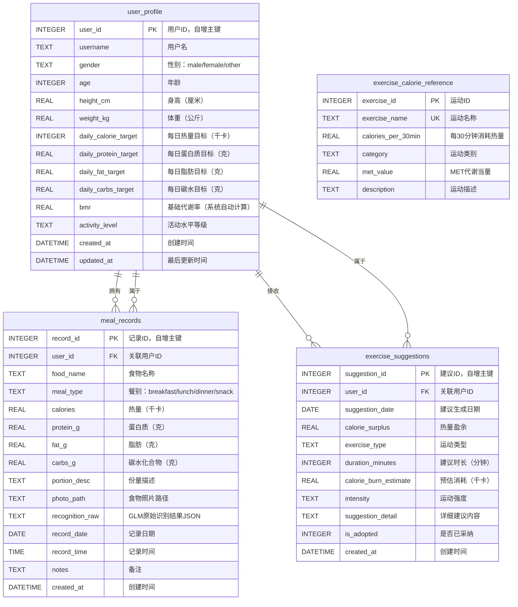
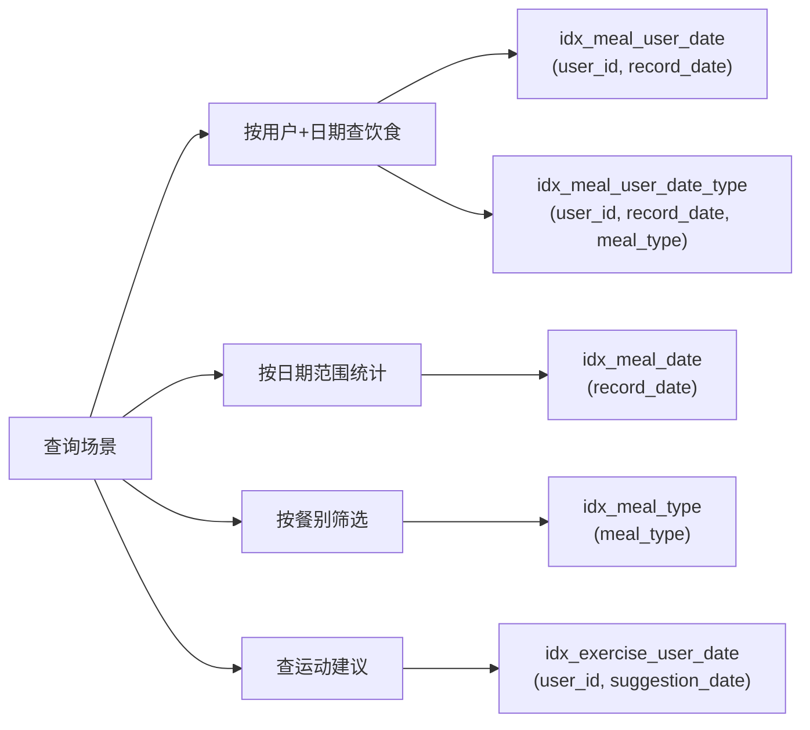
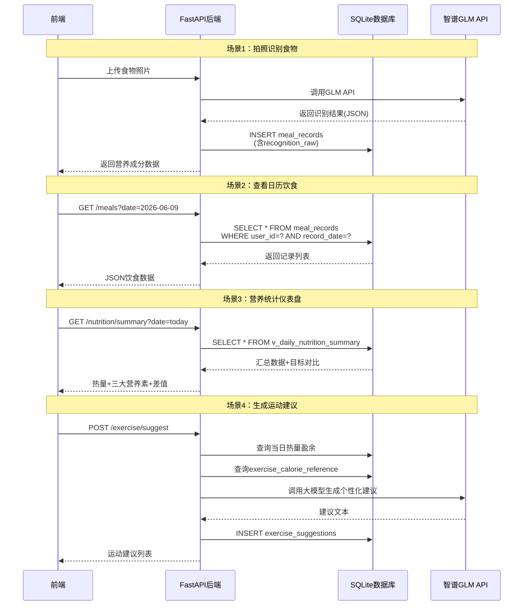

# 食物热量识别与饮食管理系统 — 原始数据库设计参考

> 运行时 schema 以 prisma/migrations/** 为唯一权威。本目录的 SQL 是课程初始设计参考，不应在正常启动时执行。


---

## 一、数据库概述

初始设计使用 SQLite 作为本地嵌入式数据库。当前 Next.js 应用中的文件实际存储在运行 Node.js 服务的本机，而不是浏览器设备；正式运行与迁移说明以根 README 和 prisma/migrations 为准。

### 设计原则

| 原则 | 说明 |
|------|------|
| **数据完整性** | 外键约束、CHECK约束保证数据一致性 |
| **查询效率** | 针对高频查询场景（按日期/用户查询饮食记录）建立复合索引 |
| **可扩展性** | 预留 JSON 字段存储 API 原始返回数据，方便后续升级 |
| **自动化** | 使用触发器自动计算 BMR、更新修改时间 |

---

## 二、ER 实体关系图



---

## 三、表结构详细说明

### 3.1 用户个人信息表 `user_profile`

存储用户的身体参数和营养目标，是整个系统的核心基础表。

| 字段名 | 类型 | 约束 | 说明 |
|--------|------|------|------|
| `user_id` | INTEGER | PK, AUTOINCREMENT | 用户唯一标识 |
| `username` | TEXT | NOT NULL | 用户名/昵称 |
| `gender` | TEXT | NOT NULL, CHECK | 性别：`male`/`female`/`other` |
| `age` | INTEGER | NOT NULL, CHECK(>0, <150) | 年龄 |
| `height_cm` | REAL | NOT NULL, CHECK(>0) | 身高（厘米） |
| `weight_kg` | REAL | NOT NULL, CHECK(>0) | 体重（公斤） |
| `daily_calorie_target` | INTEGER | NOT NULL, DEFAULT 2000 | 每日热量摄入目标 |
| `daily_protein_target` | REAL | NOT NULL, DEFAULT 60.0 | 每日蛋白质目标（g） |
| `daily_fat_target` | REAL | NOT NULL, DEFAULT 60.0 | 每日脂肪目标（g） |
| `daily_carbs_target` | REAL | NOT NULL, DEFAULT 250.0 | 每日碳水目标（g） |
| `bmr` | REAL | — | 基础代谢率，由触发器自动计算 |
| `activity_level` | TEXT | NOT NULL, DEFAULT 'sedentary' | 活动水平 |
| `created_at` | DATETIME | NOT NULL | 创建时间 |
| `updated_at` | DATETIME | NOT NULL | 最后更新时间 |

**活动水平枚举值：**

| 值 | 含义 | 活动系数 |
|----|------|----------|
| `sedentary` | 久坐不动（几乎不运动） | 1.2 |
| `lightly_active` | 轻度活动（每周1-3天） | 1.375 |
| `moderately_active` | 中度活动（每周3-5天） | 1.55 |
| `very_active` | 高度活跃（每周6-7天） | 1.725 |
| `extra_active` | 极高活跃（高强度体力劳动） | 1.9 |

**BMR 自动计算（Mifflin-St Jeor 公式）：**

- 男性：$BMR = 10 \times W + 6.25 \times H - 5 \times A + 5$
- 女性：$BMR = 10 \times W + 6.25 \times H - 5 \times A - 161$

> 其中 $W$ = 体重(kg)，$H$ = 身高(cm)，$A$ = 年龄  
> 当用户更新体重、身高、年龄或性别时，`trg_calc_bmr_update` 触发器会自动重算 BMR。

---

### 3.2 饮食记录表 `meal_records`

每条记录代表用户一餐中的一个食物项，是系统的核心数据表。

| 字段名 | 类型 | 约束 | 说明 |
|--------|------|------|------|
| `record_id` | INTEGER | PK, AUTOINCREMENT | 记录唯一标识 |
| `user_id` | INTEGER | FK → user_profile, NOT NULL | 所属用户 |
| `food_name` | TEXT | NOT NULL | 食物名称 |
| `meal_type` | TEXT | NOT NULL, CHECK | 餐别类型 |
| `calories` | REAL | NOT NULL, CHECK(≥0) | 热量（千卡） |
| `protein_g` | REAL | NOT NULL, DEFAULT 0 | 蛋白质含量（克） |
| `fat_g` | REAL | NOT NULL, DEFAULT 0 | 脂肪含量（克） |
| `carbs_g` | REAL | NOT NULL, DEFAULT 0 | 碳水化合物含量（克） |
| `portion_desc` | TEXT | — | 份量描述（如"1碗约200g"） |
| `photo_path` | TEXT | — | 食物照片文件路径 |
| `recognition_raw` | TEXT | — | GLM API 原始返回的 JSON |
| `record_date` | DATE | NOT NULL | 记录日期（YYYY-MM-DD） |
| `record_time` | TIME | NOT NULL | 记录时间（HH:MM:SS） |
| `notes` | TEXT | — | 用户备注 |
| `created_at` | DATETIME | NOT NULL | 创建时间 |

**餐别枚举值：**

| 值 | 含义 | 典型时间范围 |
|----|------|-------------|
| `breakfast` | 早餐 | 06:00–10:00 |
| `lunch` | 午餐 | 11:00–14:00 |
| `dinner` | 晚餐 | 17:00–21:00 |
| `snack` | 加餐/零食 | 任意时间 |

**`recognition_raw` JSON 字段结构（示例）：**

```json
{
    "model": "glm-4v-plus",
    "foods": [
        {"name": "鸡蛋", "confidence": 0.95, "portion": "2个", "calories": 144, "protein": 12.6, "fat": 9.6, "carbs": 1.2},
        {"name": "米饭", "confidence": 0.88, "portion": "1碗", "calories": 260, "protein": 5.2, "fat": 0.6, "carbs": 57.0}
    ],
    "total_calories": 404,
    "analysis_time": "2026-06-09T08:00:00Z"
}
```

---

### 3.3 运动建议表 `exercise_suggestions`

存储系统根据用户当日饮食情况生成的个性化运动建议。

| 字段名 | 类型 | 约束 | 说明 |
|--------|------|------|------|
| `suggestion_id` | INTEGER | PK, AUTOINCREMENT | 建议唯一标识 |
| `user_id` | INTEGER | FK → user_profile, NOT NULL | 所属用户 |
| `suggestion_date` | DATE | NOT NULL | 建议对应日期 |
| `calorie_surplus` | REAL | — | 热量盈余（摄入量 - 目标量） |
| `exercise_type` | TEXT | NOT NULL | 推荐运动类型 |
| `duration_minutes` | INTEGER | NOT NULL, CHECK(>0) | 建议运动时长 |
| `calorie_burn_estimate` | REAL | NOT NULL | 预估消耗热量 |
| `intensity` | TEXT | CHECK | 运动强度：low/moderate/high |
| `suggestion_detail` | TEXT | — | AI生成的详细建议文本 |
| `is_adopted` | INTEGER | DEFAULT 0 | 用户是否采纳（0/1） |
| `created_at` | DATETIME | NOT NULL | 创建时间 |

---

### 3.4 运动热量参考表 `exercise_calorie_reference`

常见运动项目的热量消耗参考数据，以 60kg 体重为基准。

| 字段名 | 类型 | 约束 | 说明 |
|--------|------|------|------|
| `exercise_id` | INTEGER | PK, AUTOINCREMENT | 运动ID |
| `exercise_name` | TEXT | UNIQUE, NOT NULL | 运动名称 |
| `calories_per_30min` | REAL | NOT NULL | 每30分钟消耗（千卡/60kg） |
| `category` | TEXT | CHECK | 运动类别 |
| `met_value` | REAL | — | MET 代谢当量值 |
| `description` | TEXT | — | 简要描述 |

**热量换算公式**：

$$实际消耗 = 参考值 \times \frac{用户体重}{60} \times \frac{运动时长}{30}$$

---

## 四、视图说明

| 视图名称 | 用途 | 粒度 |
|----------|------|------|
| `v_daily_nutrition_summary` | 每日营养摄入汇总 + 与目标对比 | 用户 × 日 |
| `v_weekly_nutrition_summary` | 每周营养平均摄入统计 | 用户 × ISO周 |
| `v_monthly_nutrition_summary` | 每月营养平均摄入统计 | 用户 × 月 |
| `v_meal_type_summary` | 按餐别汇总当日营养 | 用户 × 日 × 餐别 |

### `v_daily_nutrition_summary` 核心字段

| 计算字段 | 公式 |
|----------|------|
| `total_calories` | `SUM(calories)` |
| `total_protein_g` | `SUM(protein_g)` |
| `total_fat_g` | `SUM(fat_g)` |
| `total_carbs_g` | `SUM(carbs_g)` |
| `meal_count` | `COUNT(record_id)` |
| `calorie_diff` | `total_calories - daily_calorie_target` |

> 前端图表可直接查询此视图获取每日统计数据，`calorie_diff > 0` 表示超标，`< 0` 表示不足。

---

## 五、索引策略



| 索引名 | 字段 | 覆盖场景 |
|--------|------|----------|
| `idx_meal_user_date` | `(user_id, record_date)` | 日历视图加载当日饮食 |
| `idx_meal_user_date_type` | `(user_id, record_date, meal_type)` | 按餐别查看当日记录 |
| `idx_meal_date` | `(record_date)` | 周/月趋势分析查询 |
| `idx_meal_type` | `(meal_type)` | 按餐别统计 |
| `idx_exercise_user_date` | `(user_id, suggestion_date)` | 查询某日运动建议 |

---

## 六、触发器说明

| 触发器名 | 触发时机 | 功能 |
|----------|----------|------|
| `trg_user_profile_updated_at` | UPDATE user_profile | 自动更新 `updated_at` 字段 |
| `trg_calc_bmr_insert` | INSERT user_profile | 新增用户时自动计算 BMR |
| `trg_calc_bmr_update` | UPDATE OF (weight_kg, height_cm, age, gender) | 身体参数变更时自动重算 BMR |
| `trg_meal_record_time` | INSERT meal_records (record_time IS NULL) | 未提供时间时自动填当前时间 |

---

## 七、常用查询SQL示例

### 7.1 日历视图 — 查询某日所有餐别记录

```sql
SELECT record_id, food_name, meal_type, calories, protein_g, fat_g, carbs_g,
       portion_desc, record_time, photo_path
FROM meal_records
WHERE user_id = ? AND record_date = ?
ORDER BY
    CASE meal_type
        WHEN 'breakfast' THEN 1
        WHEN 'lunch' THEN 2
        WHEN 'dinner' THEN 3
        WHEN 'snack' THEN 4
    END,
    record_time;
```

### 7.2 仪表盘 — 当日营养摄入 vs 目标

```sql
SELECT *
FROM v_daily_nutrition_summary
WHERE user_id = ? AND record_date = date('now', 'localtime');
```

### 7.3 趋势图 — 近7天热量摄入趋势

```sql
SELECT record_date, total_calories, daily_calorie_target, calorie_diff
FROM v_daily_nutrition_summary
WHERE user_id = ?
  AND record_date >= date('now', '-7 days', 'localtime')
ORDER BY record_date;
```

### 7.4 趋势图 — 近30天热量摄入趋势（按月）

```sql
SELECT *
FROM v_monthly_nutrition_summary
WHERE user_id = ?
  AND record_date >= date('now', '-30 days', 'localtime')
ORDER BY year, month;
```

### 7.5 饼图 — 当日三大营养素占比

```sql
SELECT
    '蛋白质' AS nutrient, total_protein_g * 4 AS calorie_from_nutrient
FROM v_daily_nutrition_summary WHERE user_id = ? AND record_date = ?
UNION ALL
SELECT '脂肪', total_fat_g * 9 FROM v_daily_nutrition_summary WHERE user_id = ? AND record_date = ?
UNION ALL
SELECT '碳水', total_carbs_g * 4 FROM v_daily_nutrition_summary WHERE user_id = ? AND record_date = ?;
```

### 7.6 运动建议 — 根据热量盈余推荐运动

```sql
SELECT exercise_name, calories_per_30min, category,
       ROUND(? * 60.0 / ? * calories_per_30min, 0) AS estimated_cal_per_30min,
       ROUND(? / (calories_per_30min * ? / 60.0) * 30, 0) AS suggested_minutes
FROM exercise_calorie_reference
WHERE category = 'aerobic'
ORDER BY ABS(calories_per_30min - ? / (? / 60.0 * 30)) ASC
LIMIT 5;
-- 参数: 用户体重, 60(基准体重), 热量盈余, 用户体重, 热量盈余
```

### 7.7 周报 — 本周饮食概览

```sql
SELECT *
FROM v_weekly_nutrition_summary
WHERE user_id = ?
  AND year = strftime('%Y', 'now')
  AND week_number = strftime('%W', 'now')
LIMIT 1;
```

---

## 八、数据流与API对接



---

## 九、文件清单

```
database/
├── schema.sql          # 建表脚本（表+索引+视图+触发器）
├── init_data.sql       # 初始化数据（运动参考数据+示例数据）
└── README.md           # 本设计文档
```

### 使用方式

```bash
# 1. 创建新数据库并执行建表脚本
sqlite3 food_tracker.db < schema.sql

# 2. 导入初始化数据
sqlite3 food_tracker.db < init_data.sql

# 3. 或在代码中初始化（Java示例）
# jdbc:sqlite:food_tracker.db
# 执行 schema.sql 和 init_data.sql 的内容
```
