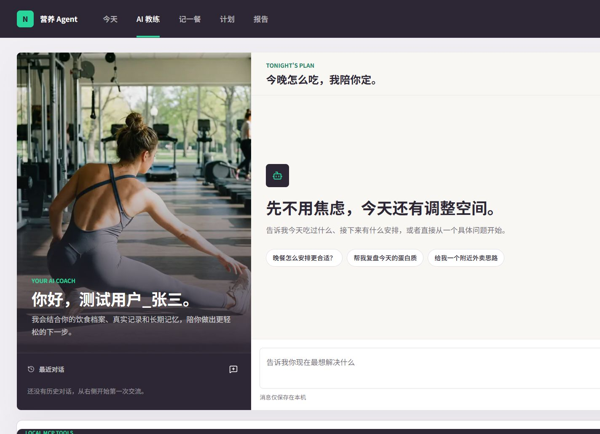
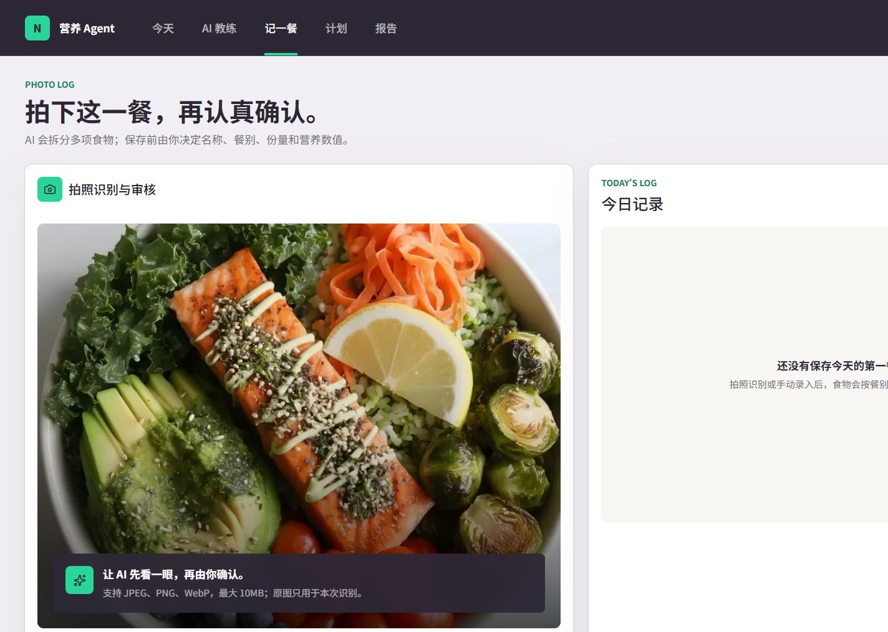
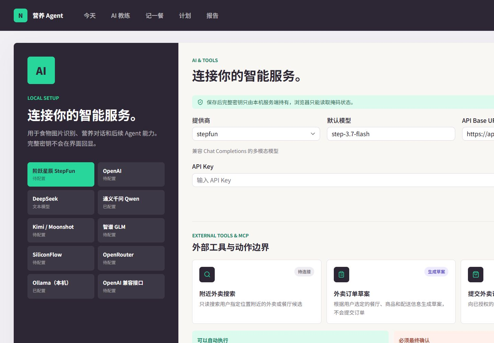
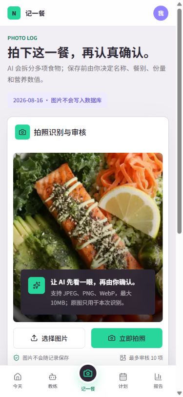
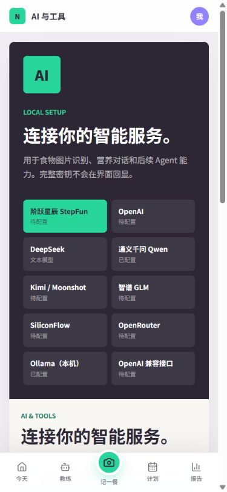
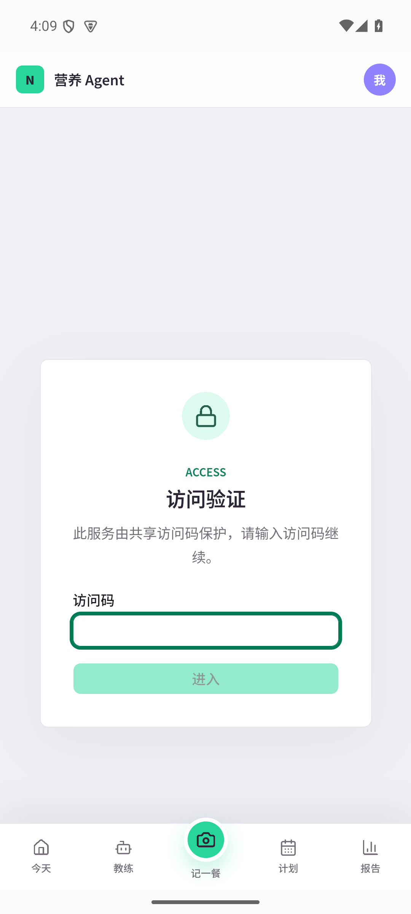

# C-12 云端演示与核心 E2E

这组素材来自公网云端实例的测试用户 1。数据通过真实 HTTP API 和真实 Web UI 产生，未调用下单提交或支付动作；访问码、AI API Key 和 MCP Token 不进入截图或文档。

## 核心闭环

| 闭环 | 结果 | 真实观测 |
| --- | --- | --- |
| 拍照识别 | 通过 | 上传 `meal-hero.webp`，AI 返回 9 项，审核确认后保存 9 项；今日记录变为 13 项 |
| 健康 Agent | 通过 | 真实对话线程 4，时间线 2/2 步骤完成，生成建议约 59.1 秒，并引用饮食、运动和长期记忆 |
| 麦当劳 MCP | 通过 | `/api/settings/mcdonalds/test` 返回 HTTP 200、29 个工具、646ms；仅探测工具列表，不创建订单 |

完整的结构化证据位于 [`real-core-flows.json`](../../dev_repo/evidence/C-12/e2e/real-core-flows.json)，数据生成账本位于 [`data-manifest.json`](../../dev_repo/evidence/C-12/data-manifest.json)。

## 本次云端截图

桌面原始截图为 1440x1000；IAB 截图管道在同一会话中出现横向重复渲染，因此文档使用左侧干净裁切图，同时保留原始文件 [`c12-dashboard-desktop.png`](c12-dashboard-desktop.png) 供排查。移动截图为真实 375x812 云端视口。

## UI 参考图

以下图片是仓库已有的 C-05 UI 回归素材，作为 Agent、拍照识别、设置页的视觉参考；它们不是本次 C-12 数据回归的结果截图。

| Agent | 拍照识别 | 设置与凭据引导 |
| --- | --- | --- |
|  |  |  |
|  |  |  |

访问门参考图（输入框为空，不含访问码）：

## 数据范围

- 14 天 × 4 项餐食模板，覆盖 2026-08-05 至 2026-08-18。
- 7 天活动量，包含步数、活动消耗和运动分钟。
- 3 条已采纳训练计划，3 条长期记忆。
- Web 移动视口读取到同一用户的 13 项今日记录和同一段 Agent 回复；本轮无 ADB 设备，因此 Android 继续引用 C-11-S3 的同源实证。

## 安全边界

- 只写测试用户 1；测试用户 2 在 S1 回读中保持未改变。
- MCP smoke 只执行连接探测与工具发现，未调用创建订单、提交订单或支付。
- 截图、README 和证据 JSON 不含访问码、API Key、MCP Token 或完整凭据。
